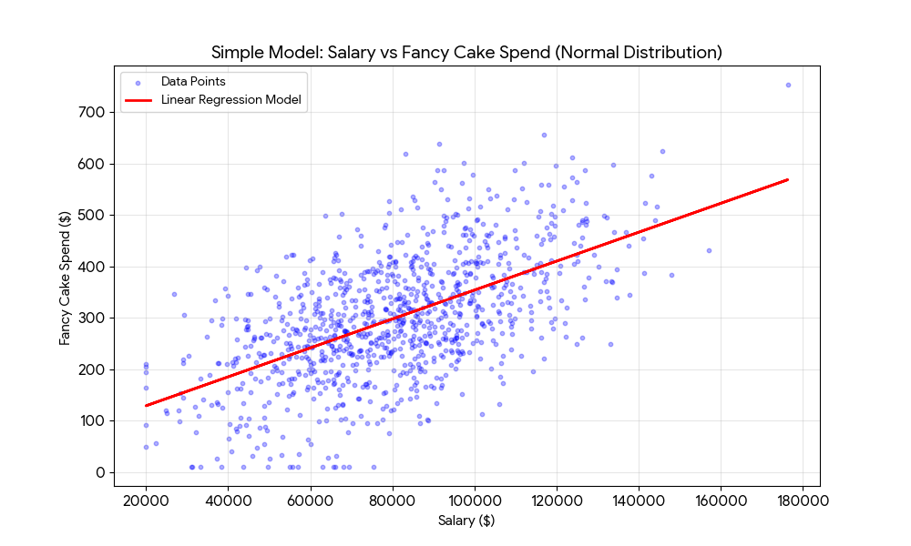
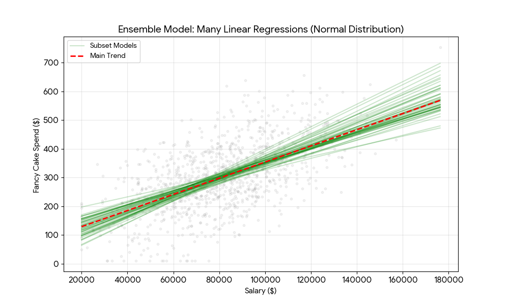
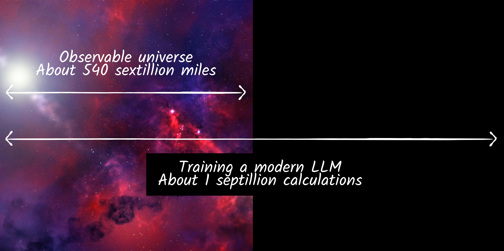

[In my last post](/blog/2025-11-01-explainability-challenge/), I shared why I think Explainability is the number one problem in AI right now. But why do we have this problem? Why is it a problem at all?

## 1. A Simple, Explainable Model

Let's take a super simple mathematical model to start: a linear regression with one dimension.

For example, based on how much you earn, can we predict how much will you spend on a fancy birthday cake? Let's say we use 10,000 random known samples to create our model. Maybe it will look something like this:

Here's the maths:

$$\text{Expected spend} = (a \times \text{salary}) + b$$

<!-- Expected_spend_on_fancy_cake = (a * salary) + b -->

We use a simple algorithm to calculate what a and b are, based on the known data, and we can then use these figures to predict spend for all sorts of new people who we meet. That's machine learning at its most basic.

This model is very easy to explain and understand. It's very transparent. You can see how the model works, and you can see for your individual prediction, how it was arrived at based on the information you put in. And - crucially - it's easy to pull apart and critique. Where did the data come from? Does this formula really represent me?

We like this. It's good because we get it. We can see its rudimentary, probabilistic nature, and we can see all its flaws and where it doesn't work.

## 2. The Cost of Complexity

Now let's take a more complex model, let's say an ensemble of linear regressions.

Rather than training just one, we train a thousand linear regression models across different random subsets of our original data. Now when we want to make a prediction, we actually make 1000 predictions - one with each model - and take the average of these as our final prediction.

In what appears to be magic, but is actually just probability at work, we tend to get more accurate predictions overall. (If you want to understand why, [read this](https://en.wikipedia.org/wiki/Bootstrap_aggregating).)

And this is the fundamental, core brilliance of maths and AI in helping us to predict things. By increasing the complexity of a model in certain ways, we can increase its predictive power.

But this comes at a cost: **explainability**.

It's now much harder to explain how our model works, and for a user to interrogate it, question it, understand how it came to a particular conclusion.

It's hard to do 1000 predictions and calculate the average in your head. Although a simple visualisation helps us to understand it:

## 3. The Black Box Problem

If a 1000-linear regression ensemble seems complex, consider a modern neural network. Our single linear regression has two parameters: a and b. Our simple 1000-part ensemble has 2000. A model like Gemini 1.5 Pro has approximately 1.5 trillion parameters; GPT-4 is estimated at 1.76 trillion parameters.

But it's way more complex than that. Neural net-based AI is different in kind, not just degree.

In a linear regression, it's pretty easy to explain and understand what the parameters mean, even if it takes a bit of thinking. Neural nets' parameters are not intelligible in this way.

You can't just look up a parameter that you multiply by something to get the next word in a sentence. There aren't even individual parameters in the model that correspond to human concepts that we can interrogate to check if we agree with them. There aren't individual parameters we can refer to if we want to understand why a model chose one word over another in its output. Each word or pixel is the result of trillions of calculations. Which is insane.

So why on earth do we use neural nets? Because they work - because, for certain types of AI tasks, they create the best results. Not all tasks. Much simpler models are often much better for tasks such as predicting future house prices, whether someone will default on a loan, and probably for predicting how much someone will spend on a fancy cake. And their explainability is a massive boon.

But for creating human like text and imagery and things, neural nets reign supreme.

## 4. How Do We End Up With Black Box Models?

So if a neural net is just maths, how on earth do we end up with maths that does something where we understand the input, and the output, but we have **no idea how the internal logic works?** How do we end up with what is still essentially a very complex formula, but with trillions of parameters that are completely unintelligible to humans? Where do these come from?

It's because of the way AI is created. We don't design the calculations by hand, we don't use logical reasoning as humans to inspect the data, work out what the important factors are, and from this construct an algorithm or a sequence of calculations that we think will come up with a good result.

Instead, we write a software programme whose job it is to come up with that incredibly complex formula. The programme does this by repeatedly exploring and evaluating different values for its trillions of parameters until it achieves an accuracy threshold that meets what we are after. This is what we call training.

To get a sense of scale here, a single training run for a model like Gemini Pro is estimated to require over 1 YottaFLOP. That's one septillion calculations: 1,000,000,000,000,000,000,000,000.

To put that in context, the observable universe is estimated to be a mere [540 sextillion](https://www.bbc.co.uk/future/article/20210326-the-mystery-of-our-expanding-universe) - about half of the number - of miles across.

And hundreds or thousands of training runs may be needed to get a satisfactory model.

Staggering.

Enough of the astronomical numbers.

The point being, as a human, even as the developer working on that project, I have no idea what any of the parameter values in that formula mean, or what they are, or what they do. That's why it's a black box.
 
I just know that when the model is tested - robustly tested - it *should* work, because it worked in development and evaluation.

So there's the rub. It *should* work. As a good developer, I've worked hard to make sure my training data is good and fair and representative; and I've built into my training process a robust, statistically sound evaluation mechanism, so that my final model performs acceptably against my evaluation data. So although I have no idea how it actually works, I have gold standard empirical evidence that it does in fact work.

X% of the time. 

This is why, when we want to know how or why this or that model made a particular prediction, we can't just open up the engine or the source code and have a look. This is why its really, really hard to explain how predictions are made, because the intermediate states from input to output are not readily interpretable to humans. It's not just a matter of scale, it's that what's going on the middle is practically meaningless to us.

## 5. The Consequence of Opacity

Since AI is probabilistic - not deterministic - and imperfect in many ways, as well as being highly sensitive to training data, evaluation process, human inputs... because of all of this, when we are using it, we really do need to be able to inspect what's going on. We need to be in the driving seat. Whether we are users, owners or operators, we need to be able to link inputs to outputs and actions and make sure we are happy with them.

That's a fundamental pillar of user experience, of risk management, of so many different disciplines in technology. Everyone gets this. It's why end users want to feel in control, why legislators want to understand the detail of how things work, why businesses are concerned about implementation risks.

It's hard to see how AI can progress at pace, outside of experimental and low-risk use cases, without solving these issues. It doesn't matter how exciting a new innovation is, if people don't feel comfortable using it then they won't. Period.

This is why the 'Black Box' is not just a technical curiosity; it is a governance crisis. If we cannot explain the model, we cannot fully trust its decisions in critical infrastructure. **We cannot regulate what we cannot read**.

That's the Explainability Problem. In my next post, I'm going to explore the current state of AI explainability, and why, from a user perspective, it's not doing what we need it to. Then we can start to explore solutions.
